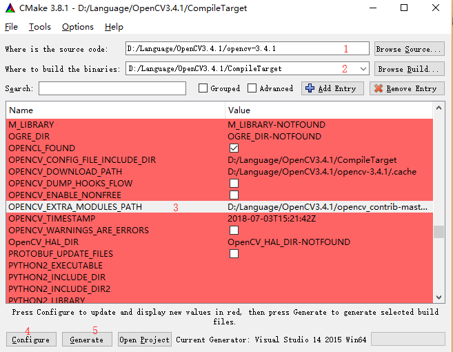
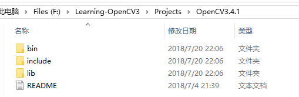

# OpenCV3安装和配置

[TOC]

安装环境为： **VS2015+OpenCV3.4.1    Windows10_x64**


## 一：下载

进入OpenCV官网：https://opencv.org/ 下载对应的OpenCV版本。

OpenCV版本分为：2.4.X版本和3.x.x版本，下载3.4.1版本源码（为此时的最新版）。

下载Contrib模块：https://github.com/opencv/opencv_contrib


## 二：编译

使用CMake编译。打开CMake选择 [Brouse Source…] 路径为OpenCV源码路径，[Brouse Build…] 为输出路径，并将 OPENCV_EXTRA_MODULES_PATH 设置为contrib的解压路径：



选择VS2015 x64项目配置

Configure... 直到配置成功（无红色项），期间会下载一些依赖模块；

Generate... 在输出目录生成工程。

之后打开工程，Debug/Release 下Build and Install直到成功。


## 三：安装和配置

### 3.1 通用依赖文件

拷贝 xxx\install\include 到 **OpenCV3.4.1\include**;

拷贝 xxx\install\x64\vc14\lib 到 **OpenCV3.4.1\lib**;

拷贝 xxx\install\x64\vc14\bin 到 **OpenCV3.4.1\bin**;



###3.2 工程模板

新建VS2015控制台空项目，命名为OpenCV3，为工程添加基本的main.cpp主文件。之后配置x64模式下的Debug和Release模式，分别加入头文件目录：


和库目录：


并将需要的依赖库包含入项目中，建议学习使用的话全部包括，Debug下有：

```
opencv_calib3d341d.lib;
opencv_ccalib341d.lib;
opencv_core341d.lib;
opencv_features2d341d.lib;
opencv_imgcodecs341d.lib;
opencv_imgproc341d.lib;
opencv_stitching341d.lib;
opencv_video341d.lib;
opencv_videoio341d.lib;
opencv_xfeatures2d341d.lib;
opencv_ximgproc341d.lib;
opencv_highgui341d.lib;
opencv_aruco341d.lib;
opencv_bgsegm341d.lib;
opencv_bioinspired341d.lib;
opencv_cudaarithm341d.lib;
opencv_cudabgsegm341d.lib;
opencv_cudacodec341d.lib;
opencv_cudafeatures2d341d.lib;
opencv_cudafilters341d.lib;
opencv_cudaimgproc341d.lib;
opencv_cudalegacy341d.lib;
opencv_cudaobjdetect341d.lib;
opencv_cudaoptflow341d.lib;
opencv_cudastereo341d.lib;
opencv_cudawarping341d.lib;
opencv_cudev341d.lib;
opencv_datasets341d.lib;
opencv_dnn_objdetect341d.lib;
opencv_dnn341d.lib;
opencv_dpm341d.lib;
opencv_face341d.lib;
opencv_flann341d.lib;
opencv_fuzzy341d.lib;
opencv_hfs341d.lib;
opencv_img_hash341d.lib;
opencv_line_descriptor341d.lib;
opencv_ml341d.lib;
opencv_objdetect341d.lib;
opencv_optflow341d.lib;
opencv_phase_unwrapping341d.lib;
opencv_photo341d.lib;
opencv_plot341d.lib;
opencv_reg341d.lib;
opencv_rgbd341d.lib;
opencv_saliency341d.lib;
opencv_shape341d.lib;
opencv_stereo341d.lib;
opencv_structured_light341d.lib;
opencv_superres341d.lib;
opencv_surface_matching341d.lib;
opencv_text341d.lib;
opencv_tracking341d.lib;
opencv_videostab341d.lib;
opencv_xobjdetect341d.lib;
opencv_xphoto341d.lib;
```

这样，OpenCV3.4.1在VS2015下的配置就设置好了。可以把这个作为OpenCV3开发的模板工程，之后直接复制过去使用就可以了。


## 四：工程测试

在main.cpp输入以下代码：

````c++
#include <iostream>
#include "opencv2\opencv.hpp"
using namespace cv;

int main()
{
	Mat src = imread("../Sources/boat1.jpg");
	if (src.empty())
		return -1;

	namedWindow("OpenCV3", WINDOW_AUTOSIZE);
	imshow("OpenCV3", src);
	waitKey(0);

	return 0;
}
````

首先需要准备一张命名为”boat1.jpg“的测试图片并放到生成目录下，之后将bin下的动态库拷贝到生成目录，编译运行。如果没有成功则检查配置是否正确。

> 注意库存放的路径，上面配置时使用的是相对路径。