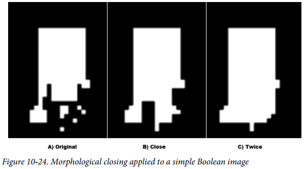

# 第十章 滤波和卷积

[TOC]

## 一：介绍
滤波使用滤波核进行操作，使用卷积完成。当核的中心在边界时，外围无像素参与运算，因此滤波时往往涉及对边界的处理。首先，需要对原图像的边界进行填充，填充方式有多种；然后，对填充过的图像进行邻域操作、卷积等；之后，对处理过的图像进行裁剪，去掉多余的边界得到需要的图像。
边界填充可以使用：
```c++
void cv::copyMakeBorder(
  cv::InputArray    src,                       // Input image
  cv::OutputArray   dst,                       // Result image
  int               top,                       // Top side padding (pixels)
  int               bottom,                    // Bottom side padding (pixels)
  int               left,                      // Left side padding (pixels)
  int               right,                     // Right side padding (pixels)
  int               borderType,                // Pixel extrapolation method
  const cv::Scalar& value = cv::Scalar()       // Used for constant borders
);
```
borderType指定了填充方式，可选方式有：
| Border type            | Effect                                   |
| ---------------------- | ---------------------------------------- |
| cv::BORDER_CONSTANT    | Extend pixels by using a supplied (constant) value |
| cv::BORDER_WRAP        | Extend pixels by replicating from opposite side |
| cv::BORDER_REPLICATE   | Extend pixels by copying edge pixel      |
| cv::BORDER_REFLECT     | Extend pixels by reflection              |
| cv::BORDER_REFLECT_101 | Extend pixels by reflection, edge pixel is not “doubled” |
| cv::BORDER_DEFAULT     | Alias for cv::BORDER_REFLECT_101         |

此外，还可以计算原图像与扩展图像像素的对应关系，通过函数：
```c++
int cv::borderInterpolate(       // Returns coordinate of "donor" pixel
  int p,                         // 0-based coordinate of extrapolated pixel
  int len,                       // Length of array (on relevant axis)
  int borderType                 // Pixel extrapolation method
);
```


## 二：阈值处理

###2.1 阈值
阈值处理可以将图像根据阈值进行二值化，实现函数为：
```c++
double cv::threshold(
  cv::InputArray    src,             // Input image
  cv::OutputArray   dst,             // Result image
  double            thresh,          // Threshold value
  double            maxValue,        // Max value for upward operations
  int               thresholdType    // Threshold type to use (Example 10-3)
);
```
thresholdType类型有：
| Threshold type        | Operation                      |
| --------------------- | ------------------------------ |
| cv::THRESH_BINARY     | DST1=(SRC1>thresh)?MAXVALUE:0  |
| cv::THRESH_BINARY_INV | DST1=(SRC1>thresh)?0:MAXVALUE  |
| cv::THRESH_TRUNC      | DST1=(SRC1>thresh)?THRESH:SRC1 |
| cv::THRESH_TOZERO     | DST1=(SRC1>thresh)?SRC1:0      |
| cv::THRESH_TOZERO_INV | DST1=(SRC1>thresh)?0:SRC1      |

示例：
```c++
#include <opencv2/opencv.hpp>
#include <iostream>
using namespace std;

void sum_rgb( const cv::Mat& src, cv::Mat& dst ) 
{
  // Split image onto the color planes.
  //
  vector<cv::Mat> planes;
  cv::split(src, planes);
  cv::Mat b = planes[0], g = planes[1], r = planes[2];
  // Accumulate separate planes, combine and threshold.
  //
  cv::Mat s = cv::Mat::zeros(b.size(), CV_32F);
  cv::accumulate(b, s);
  cv::accumulate(g, s);
  cv::accumulate(r, s);
  // Truncate values above 100 and rescale into dst.
  //
  cv::threshold( s, s, 100, 100, cv::THRESH_TRUNC );
  s.convertTo(dst, b.type());
}

void help() 
{
    cout << "Call: ./ch10_ex10_1 faceScene.jpg" << endl;
    cout << "Shows use of alpha blending (addWeighted) and threshold" << endl;
}

int main(int argc, char** argv) 
{
    help();
    if(argc < 2) { cout << "specify input image" << endl; return -1; }
    // Load the image from the given file name.
    cv::Mat src = cv::imread( argv[1] ), dst;
    if( src.empty() ) { cout << "can not load " << argv[1] << endl; return -1; }
    sum_rgb( src, dst);
    // Create a named window with the name of the file and
    // show the image in the window
    cv::imshow( argv[1], dst );
    // Idle until the user hits any key.
    cv::waitKey(0);
    return 0;
}
```
### 2.2 最佳阈值
Otsu’s Algorithm实现最佳阈值的处理，需要给cv::threshold传递cv::THRESH_OTSU值作为阈值。
### 2.3 自适应阈值
```c++
void cv::adaptiveThreshold(
  cv::InputArray    src,                 // Input image
  cv::OutputArray   dst,                 // Result image
  double            maxValue,            // Max value for upward operations
  int               adaptiveMethod,      // mean or Gaussian
  int               thresholdType        // Threshold type to use (Example 10-3)
  int               blockSize,           // Block size
  double            C                    // Constant
);
```
自适应阈值处理具有更好的处理效果，可以自动调整计算阈值，考虑到例如光照之类的影响。
```c++
#include <iostream>
using namespace std;
int main( int argc, char** argv )
{
  if(argc != 7) { cout <<
   "Usage: " <<argv[0] <<" fixed_threshold invert(0=off|1=on) "
   "adaptive_type(0=mean|1=gaussian) block_size offset image\n"
   "Example: " <<argv[0] <<" 100 1 0 15 10 fruits.jpg\n"; return -1; }
  // Command line.
  //
  double fixed_threshold = (double)atof(argv[1]);
  int threshold_type  = atoi(argv[2]) ? cv::THRESH_BINARY : cv::THRESH_BINARY_INV;
  int adaptive_method = atoi(argv[3]) ? cv::ADAPTIVE_THRESH_MEAN_C
                                      : cv::ADAPTIVE_THRESH_GAUSSIAN_C;
  int block_size = atoi(argv[4]);
  double offset  = (double)atof(argv[5]);
  cv::Mat Igray  = cv::imread(argv[6], cv::LOAD_IMAGE_GRAYSCALE);
  // Read in gray image.
  //
if( Igray.empty() ){ cout << "Can not load " << argv[6] << endl; return -1; }
  // Declare the output images.
  //
  cv::Mat It, Iat;
  // Thresholds.
  //
  cv::threshold(
    Igray,
    It,
    fixed_threshold,
    255,
    threshold_type);
  cv::adaptiveThreshold(
    Igray,
    Iat,
    255,
    adaptive_method,
    threshold_type,
    block_size,
    offset
  );
  // Show the results.
  //
  cv::imshow("Raw",Igray);
  cv::imshow("Threshold",It);
  cv::imshow("Adaptive Threshold",Iat);
  cv::waitKey(0);
  return 0;
}
```


## 三：滤波

OpenCV3提供了五种滤波方式。
### 3.1 简单滤波（均值滤波）
```c++
void cv::blur(
  cv::InputArray  src,                            // Input image
  cv::OutputArray dst,                            // Result image
  cv::Size        ksize,                          // Kernel size
  cv::Point       anchor     = cv::Point(-1,-1),  // Location of anchor point
  int             borderType = cv::BORDER_DEFAULT // Border extrapolation to use
);
```
### 3.2 盒状滤波（加权均值滤波）
```c++
void cv::boxFilter(
  cv::InputArray  src,                            // Input image
  cv::OutputArray dst,                            // Result image
  int             ddepth,                         // Output depth (e.g., CV_8U)
  cv::Size        ksize,                          // Kernel size
  cv::Point       anchor     = cv::Point(-1,-1),  // Location of anchor point
  bool            normalize  = true,              // If true, divide by box area
  int             borderType = cv::BORDER_DEFAULT // Border extrapolation to use
);
```
### 3.3 中值滤波
```c++
void cv::medianBlur(
  cv::InputArray  src,                 // Input image
  cv::OutputArray dst,                 // Result image
  cv::Size        ksize                // Kernel size
);
```
### 3.4 高斯滤波
```c++
void cv::GaussianBlur(
  cv::InputArray  src,                     // Input image
  cv::OutputArray dst,                     // Result image
  cv::Size        ksize,                   // Kernel size
  double          sigmaX,                  // Gaussian half-width in x-direction
  double          sigmaY     = 0.0,        // Gaussian half-width in y-direction
  int             borderType = cv::BORDER_DEFAULT // Border extrapolation to use
);
```
### 3.5 双边滤波
```c++
void cv::bilateralFilter(
  cv::InputArray  src,             // Input image
  cv::OutputArray dst,             // Result image
  int             d,               // Pixel neighborhood size (max distance)
  double          sigmaColor,      // Width param for color weight function
  double          sigmaSpace,      // Width param for spatial weight function
  int             borderType = cv::BORDER_DEFAULT  // Border extrapolation to use
);
```

### 3.6 通用滤波

```c++
cv::filter2D(
	cv::InputArray src, 				// Input image
	cv::OutputArray dst, 				// Result image
	int ddepth, 						// Output depth (e.g., CV_8U)
	cv::InputArray kernel, 				// Your own kernel
	cv::Point anchor = cv::Point(-1,-1),// Location of anchor point
	double delta = 0, 					// Offset before assignment
	int borderType = cv::BORDER_DEFAULT // Border extrapolation to use
);
```


## 四：导数和梯度

### 4.1 Sobel导数

Sobel实现的是一阶导数。

```c++
void cv::Sobel(
  cv::InputArray  src,                 // Input image
  cv::OutputArray dst,                 // Result image
  int             ddepth,              // Pixel depth of output (e.g., CV_8U)
  int             xorder,              // order of corresponding derivative in x
  int             yorder,              // order of corresponding derivative in y
  cv::Size        ksize      = 3,      // Kernel size
  double          scale      = 1,      // Scale (applied before assignment)
  double          delta      = 0,      // Offset (applied before assignment)
  int             borderType = cv::BORDER_DEFAULT  // Border extrapolation
);
```

### 4.2 Scharr滤波
Scharr可以看作是Sobel滤波的改进版本，滤波模版：

### 4.3 拉普拉斯

Laplacian实现的是二阶导数。

```c++
void cv::Laplacian(
  cv::InputArray  src,                 // Input image
  cv::OutputArray dst,                 // Result image
  int             ddepth,              // Depth of output image (e.g., CV_8U)
  cv::Size        ksize      = 3,      // Kernel size
  double          scale      = 1,      // Scale applied before assignment to dst
  double          delta      = 0,      // Offset applied before assignment to dst
  int             borderType = cv::BORDER_DEFAULT  // Border extrapolation to use
);
```


## 五：图像形态学

### 5.1 腐蚀和膨胀
```c++
void cv::erode(
  cv::InputArray    src,                              // Input image
  cv::OutputArray   dst,                              // Result image
  cv::InputArray    element,                          // Structuring, a cv::Mat()
  cv::Point         anchor      = cv::Point(-1,-1),   // Location of anchor point
  int               iterations  = 1,                  // Number of times to apply
  int               borderType  = cv::BORDER_CONSTANT // Border extrapolation
  const cv::Scalar& borderValue = cv::morphologyDefaultBorderValue()
);
void cv::dilate(
  cv::InputArray    src,               // Input image
  cv::OutputArray   dst,               // Result image
  cv::InputArray    element,                          // Structuring, a cv::Mat()
  cv::Point         anchor      = cv::Point(-1,-1),   // Location of anchor point
  int               iterations  = 1,                  // Number of times to apply
  int               borderType  = cv::BORDER_CONSTANT // Border extrapolation
  const cv::Scalar& borderValue = cv::morphologyDefaultBorderValue()
);
```


### 5.2 通用形态学操作
通用形态学操作由cv::morphologyEx实现：
```c++
void cv::morphologyEx(
  cv::InputArray    src,                       // Input image
  cv::OutputArray   dst,                       // Result image
  int               op,                        // Operator (e.g. cv::MOP_OPEN)
  cv::InputArray    element,                   // Structuring element, cv::Mat()
  cv::Point         anchor      = cv::Point(-1,-1),  // Location of anchor point
  int               iterations  = 1,                 // Number of times to apply
  int               borderType  = cv::BORDER_DEFAULT // Border extrapolation
  const cv::Scalar& borderValue = cv::morphologyDefaultBorderValue()
);
```
Operator可取操作：
| Value of operation | Morphological operator | Requires temp image?          |
| ------------------ | ---------------------- | ----------------------------- |
| cv::MOP_OPEN       | Opening                | No                            |
| cv::MOP_CLOSE      | Closing                | No                            |
| cv::MOP_GRADIENT   | Morphological gradient | Always                        |
| cv::MOP_TOPHAT     | Top Hat                | For in-place only (src = dst) |
| cv::MOP_BLACKHAT   | Black Hat              | For in-place only (src = dst) |
**开操作和闭操作：**


**形态学梯度：**
```c++
gradient(src) = dilate(src) – erode(src)
```

**顶帽操作和底帽操作：**
```c++
TopHat(src) = src – open(src) // Isolate brighter
BlackHat(src) = close(src) – src // Isolate dimmer
```


