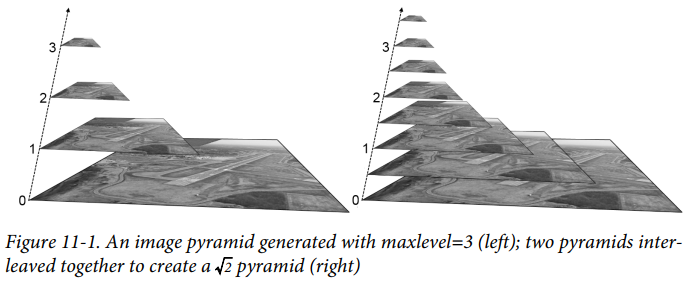
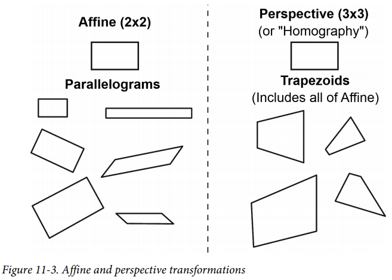
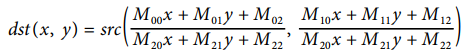
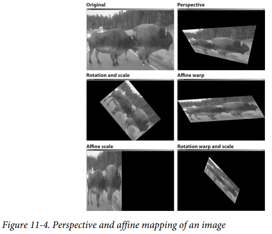
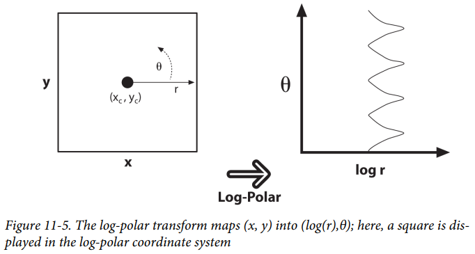
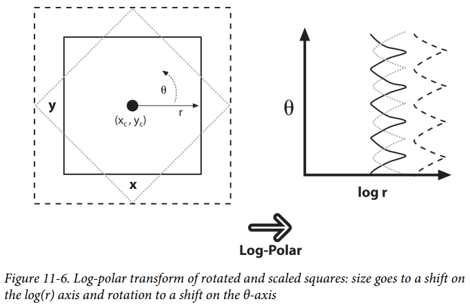
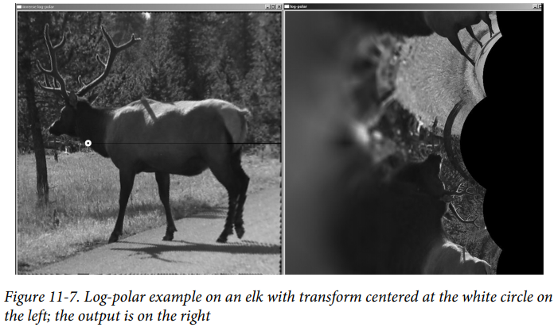
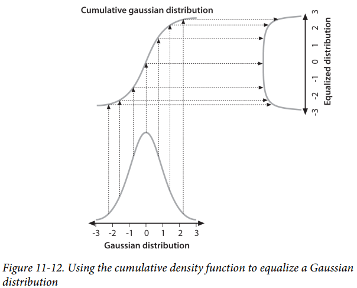
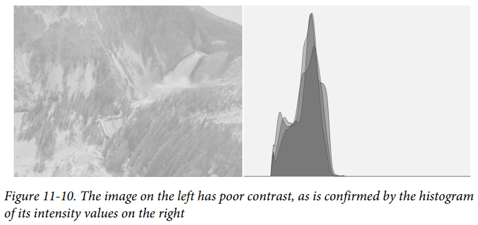
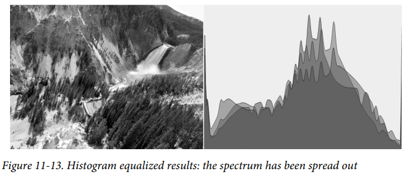

# 第十一章 通用图像变换

[TOC]

## 一：拉伸、收缩、仿射和旋转

### 1.1 缩放

cv::resize 实现对图像的缩放：

```c++
void cv::resize(
	cv::InputArray src,		// Input image
	cv::OutputArray dst,	// Result image
	cv::Size dsize,			// New size
	double fx = 0,			// x-rescale
	double fy = 0,			// y-rescale
	int interpolation = CV::INTER_LINEAR // interpolation method
);
```

对于dst大小有两种设置方式：

- **绝对大小**：设置 dsize 为绝对大小值；
- **相对大小**：设置 dsize 为 cv::Size(0,0)，设置fx和fy为缩放因子。

`interpolation` 指定插值方式，有：

| Interpolation      | Meaning                                  |
| ------------------ | ---------------------------------------- |
| cv::INTER_NEAREST  | Nearest neighbor                         |
| cv::INTER_LINEAR   | Bilinear                                 |
| cv::INTER_AREA     | Pixel area resampling                    |
| cv::INTER_CUBIC    | Bicubic interpolation                    |
| cv::INTER_LANCZOS4 | Lanczos interpolation over 8 × 8 neighborhood. |

对于插值涉及经典的 **forward projection 和 backward projection** 。前向插值为src到dst的对应，由src像素点根据map函数计算出dst像素点；后向插值为dst到src的对应，由dst根据map反向计算出src对应的像素点，在处理亚像素问题上后向投影更加实用。

### 1.2 图像金字塔

图像金字塔有 Gaussian 金字塔和 Laplace 金字塔两种，Gaussian 金字塔为下采样，每次图像宽高变为原来的1/2；Laplace 金字塔为上采样，每次图像宽高变为原来的2倍。

```c++
void cv::pyrDown(
	cv::InputArray src, // Input image
	cv::OutputArray dst, // Result image
	const cv::Size& dstsize = cv::Size() // Output image size
);

void cv::pyrUp(
	cv::InputArray src, // Input image
	cv::OutputArray dst, // Result image
	const cv::Size& dstsize = cv::Size() // Output image size
);

void cv::buildPyramid(
	cv::InputArray src, // Input image
	cv::OutputArrayOfArrays dst, // Output images from pyramid
	int maxlevel // Number of pyramid levels
);
```



### 1.3 仿射变换



 仿射变换使用2x3矩阵实现，变换前后保持平衡和比例关系。

$dst(x, y) = src(M00x + M01y + M02, M10x + M11y + M12) $

```c++
void cv::warpAffine(
	cv::InputArray src,		// Input image
	cv::OutputArray dst,	// Result image
	cv::InputArray M,		// 2-by-3 transform mtx
	cv::Size dsize,			// Destination image size
	int flags = cv::INTER_LINEAR, // Interpolation, inverse
	int borderMode = cv::BORDER_CONSTANT, // Pixel extrapolation
	const cv::Scalar& borderValue = cv::Scalar() // For constant borders
);
```

更为常规的变换方式是使用 `cv::transform`：

```c++
void cv::transform(
	cv::InputArray src,		// Input N-by-1 array (Ds channels)
	cv::OutputArray dst,	// Output N-by-1 array (Dd channels)
	cv::InputArray mtx		// Transform matrix (Ds-by-Dd)
);
```

要计算仿射变换矩阵M需要三对点，一般可以通过特征值提取等方式找到两幅图像的对应点，之后通过`cv::getAffineTransform` 得到2x3的Affine M矩阵：

```c++
cv::Mat cv::getAffineTransform(	// Return 2-by-3 matrix
	const cv::Point2f* src,		// Coordinates *three* of vertices
	const cv::Point2f* dst		// Target coords, three vertices
);
```

此外，还可以使用 `cv::getRotationMatrix2D ` 计算仿射变换的M矩阵，不过使用的较少：

```c++
cv::Mat cv::getRotationMatrix2D(// Return 2-by-3 matrix
	cv::Point2f center			// Center of rotation
	double angle,				// Angle of rotation
	double scale				// Rescale after rotation
);
```

此函数得到的仿射矩阵M有如下表达：
$$
α = scale * cos(angle)\\
β = scale * sin(angle)\\
\begin{bmatrix}
\alpha & \beta & (1-\alpha)*center_{x}-\beta*center_{y}\\ 
-\beta & \alpha & \beta*center_{x}-(1-\alpha)*center_{y} 
\end{bmatrix}
$$
M的逆矩阵可以通过以下方式获得：

```c++
void cv::invertAffineTransform(
	cv::InputArray M,	// Input 2-by-3 matrix
	cv::OutputArray iM	// Output also a 2-by-3 matrix
);
```

Affine Transform Example：

```c++
#include <opencv2/opencv.hpp>
#include <iostream>
using namespace std;

int main(int argc, char** argv) 
{
	if(argc != 2) {
		cout << "Warp affine\nUsage: " <<argv[0] <<" <imagename>\n" << endl;
		return -1;
	}

	cv::Mat src = cv::imread(argv[1],1);
	if( src.empty() ) { 
      cout << "Can not load " << argv[1] << endl; return -1; 
    }
	cv::Point3f srcTri[] = {
		cv::Point2f(0,0), // src Top left
		cv::Point2f(src.cols-1, 0), // src Top right
		cv::Point2f(0, src.rows-1) // src Bottom left
	};
	cv::Point2f dstTri[] = {
		cv::Point2f(src.cols*0.f, src.rows*0.33f), // dst Top left
		cv::Point2f(src.cols*0.85f, src.rows*0.25f), // dst Top right
		cv::Point2f(src.cols*0.15f, src.rows*0.7f) // dst Bottom left
	};
  
	// COMPUTE AFFINE MATRIX
	cv::Mat warp_mat = cv::getAffineTransform(srcTri, dstTri);
	cv::Mat dst, dst2;
	cv::warpAffine(src, dst, warp_mat, src.size(), cv::INTER_LINEAR, 
		cv::BORDER_CONSTANT, cv::Scalar());
	for( int i = 0; i < 3; ++i )
		cv::circle(dst, dstTri[i], 5, cv::Scalar(255, 0, 255), -1, cv::AA);
	cv::imshow("Affine Transform Test", dst);
	cv::waitKey();

	for(int frame=0;;++frame) {
		// COMPUTE ROTATION MATRIX
		cv::Point2f center(src.cols*0.5f, src.rows*0.5f);
		double angle = frame*3 % 360, scale = (cos((angle - 60)* cv::PI/180) + 1.05)*0.8;
		cv::Mat rot_mat = cv::getRotationMatrix2D(center, angle, scale);
		cv::warpAffine(src, dst, rot_mat, src.size(), cv::INTER_LINEAR, 
        	cv::BORDER_CONSTANT, cv::Scalar());
		cv::imshow("Rotated Image", dst);
		if(cv::waitKey(30) >= 0 )
		break;
	}
	return 0;
}
```

### 1.4 透视变换

透视变换又叫单应性变换，使用3x3矩阵完成，拥有更高的自由度。



```c++
void cv::warpPerspective(
	cv::InputArray src,		// Input image
	cv::OutputArray dst,	// Result image
	cv::InputArray M,		// 3-by-3 transform mtx
	cv::Size dsize,			// Destination image size
	int flags = cv::INTER_LINEAR, // Interpolation, inverse
	int borderMode = cv::BORDER_CONSTANT, // Extrapolation method
	const cv::Scalar& borderValue = cv::Scalar() // For constant borders
);

void cv::perspectiveTransform(
	cv::InputArray src, // Input N-by-1 array (2 or 3 channels)
	cv::OutputArray dst, // Output N-by-1 array (2 or 3 channels)
	cv::InputArray mtx // Transform matrix (3-by-3 or 4-by-4)
);
```

透视变换的透视矩阵M需要四对点，一般可以通过特征值提取等方式找到两幅图片的对应点，之后通过`cv::getPerspectiveTransform ` 获得透视变换矩阵：

```c++
cv::Mat cv::getPerspectiveTransform( // Return 3-by-3 matrix
	const cv::Point2f* src, // Coordinates of *four* vertices
	const cv::Point2f* dst // Target coords, four vertices
);
```

Perspective Transform Example:

```c++
#include <opencv2/opencv.hpp>
#include <iostream>
using namespace std;

int main(int argc, char** argv) 
{
	if(argc != 2) {
		cout << "Perspective Warp\nUsage: " <<argv[0] <<" <imagename>\n" << endl;
		return -1;
	}

	Mat src = cv::imread(argv[1],1);
	if( src.empty() ) { cout << "Can not load " << argv[1] << endl; return -1; }
	cv::Point2f srcQuad[] = {
		cv::Point2f(0, 0), // src Top left
		cv::Point2f(src.cols-1, 0), // src Top right
		cv::Point2f(src.cols-1, src.rows-1), // src Bottom right
		cv::Point2f(0, src.rows-1) // src Bottom left
	};
	cv::Point2f dstQuad[] = {
		cv::Point2f(src.cols*0.05f, src.rows*0.33f),
		cv::Point2f(src.cols*0.9f, src.rows*0.25f),
		cv::Point2f(src.cols*0.8f, src.rows*0.9f),
		cv::Point2f(src.cols*0.2f, src.rows*0.7f)
	};
	
	// COMPUTE PERSPECTIVE MATRIX
	cv::Mat warp_mat = cv::getPerspectiveTransform(srcQuad, dstQuad);
	cv::Mat dst;
	cv::warpPerspective(src, dst, warp_mat, src.size(), cv::INTER_LINEAR,
	cv::BORDER_CONSTANT, cv::Scalar());
	for( int i = 0; i < 4; i++ )
		cv::circle(dst, dstQuad[i], 5, cv::Scalar(255, 0, 255), -1, cv::AA);
	cv::imshow("Perspective Transform Test", dst);
	cv::waitKey();
	return 0;
}
```




## 二：通用映射

除了仿射和透视变换，这里将介绍一些其他的图像变换。

### 2.1 直角坐标到极坐标变换

```c++
void cv::cartToPolar(
	cv::InputArray x,			// Input single channel x-array
	cv::InputArray y,			// Input single channel y-array
	cv::OutputArray magnitude,	// Output single channel mag-array
	cv::OutputArray angle,		// Output single channel angle-array
	bool angleInDegrees = false	// Set true for degrees, else radians
);
```

### 2.2 极坐标到直角坐标变换

```c++
void cv::polarToCart(
	cv::InputArray magnitude,	// Output single channel mag-array
	cv::InputArray angle,		// Output single channel angle-array
	cv::OutputArray x,			// Input single channel x-array
	cv::OutputArray y,			// Input single channel y-array
	bool angleInDegrees = false	// Set true for degrees, else radians
);
```

### 2.3 对数极坐标变换

```c++
void cv::logPolar(
	cv::InputArray src, // Input image
	cv::OutputArray dst, // Output image
	cv::Point2f center, // Center of transform
	double m, // Scale factor
	int flags = cv::INTER_LINEAR // interpolation and fill modes
	| cv::WARP_FILL_OUTLIERS
);
```





示例：

```c++
#include <opencv2/opencv.hpp>
#include <iostream>
using namespace std;

int main(int argc, char** argv) 
{
	if(argc != 3) {
		cout << "LogPolar\nUsage: " <<argv[0] <<" <imagename> <M value>\n"
			<<"<M value>~30 is usually good enough\n";
		return -1;
	}
  
	cv::Mat src = cv::imread(argv[1],1);
	if( src.empty() ) { cout << "Can not load " << argv[1] << endl; return -1; }
	double M = atof(argv[2]);
	cv::Mat dst(src.size(), src.type()), src2(src.size(), src.type());
	cv::logPolar(src, dst, cv::Point2f(src.cols*0.5f, src.rows*0.5f),
		M, cv::INTER_LINEAR | cv::WARP_FILL_OUTLIERS);
	cv::logPolar(dst, src2, cv::Point2f(src.cols*0.5f, src.rows*0.5f),
		M, cv::INTER_LINEAR | cv::WARP_INVERSE_MAP);
	cv::imshow( "log-polar", dst );
	cv::imshow( "inverse log-polar", src2 );
	cv::waitKey();
	return 0;
}
```



###2.4 任意映射 

使用 `cv::remap` 可以实现任意的映射：

```c++
void cv::remap(
	cv::InputArray src, // Input image
	cv::OutputArray dst, // Output image
	cv::InputArray map1, // target x for src pix
	cv::InputArray map2, // target y for src pix
	int interpolation = cv::INTER_LINEAR, // Interpolation, inverse
	int borderMode = cv::BORDER_CONSTANT, // Extrapolation method
	const cv::Scalar& borderValue = cv::Scalar() // For constant borders
);
```


## 三：图像修复

### 3.1 修复

修复可以用于去除图像水印或损坏区域。

```c++
void cv::inpaint(
	cv::InputArray src,			// Input image: 8-bit, 1 or 3 channels
	cv::InputArray inpaintMask,	// 8-bit, 1 channel. Inpaint nonzeros
	cv::OutputArray dst,		// Result image
	double inpaintRadius,		// Range to consider around pixel
	int flags					// Select NS or TELEA
);
```

### 3.2 去噪

图像去噪用于去除图像噪声，主要有：

```c++
void cv::fastNlMeansDenoising(
	cv::InputArray src, // Input image
	cv::OutputArray dst, // Output image
	float h = 3, // Weight decay parameter
	int templateWindowSize = 7, // Size of patches used for comparison
	int searchWindowSize = 21 // Maximum patch distance to consider
);

void cv::fastNlMeansDenoisingColored(
	cv::InputArray src, // Input image
	cv::OutputArray dst, // Output image
	float h = 3, // Luminosity weight decay parameter
	float hColor = 3, // Color weight decay parameter
	int templateWindowSize = 7, // Size of patches used for comparison
	int searchWindowSize = 21 // Maximum patch distance to consider
);

void cv::fastNlMeansDenoisingMulti(
	cv::InputArrayOfArrays srcImgs, // Sequence of several images
	cv::OutputArray dst, // Output image
	int imgToDenoiseIndex, // Index of image to denoise
	int temporalWindowSize, // Num images to use (odd)
	float h = 3, // Weight decay parameter
	int templateWindowSize = 7, // Size of comparison patches
	int searchWindowSize = 21 // Maximum patch distance
);
void cv::fastNlMeansDenoisingColoredMulti(
	cv::InputArrayOfArrays srcImgs, // Sequence of several images
	cv::OutputArray dst, // Output image
	int imgToDenoiseIndex, // Index of image to denoise
	int temporalWindowSize, // Num images to use (odd)
	float h = 3, // Weight decay param
	float hColor = 3, // Weight decay param for color
	int templateWindowSize = 7, // Size of comparison patches
	int searchWindowSize = 21 // Maximum patch distance
);
```


## 四：直方图均衡

直方图均衡平衡图像灰度分布。OpenCV中由 `cv::equalizeHist ` 实现：

```c++
void cv::equalizeHist(
	const cv::InputArray src, // Input image
	cv::OutputArray dst // Result image
);
```



直方图均衡的示例：






