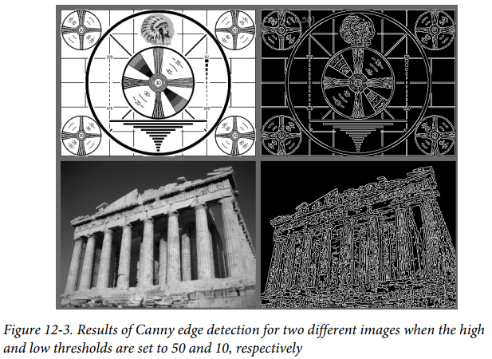
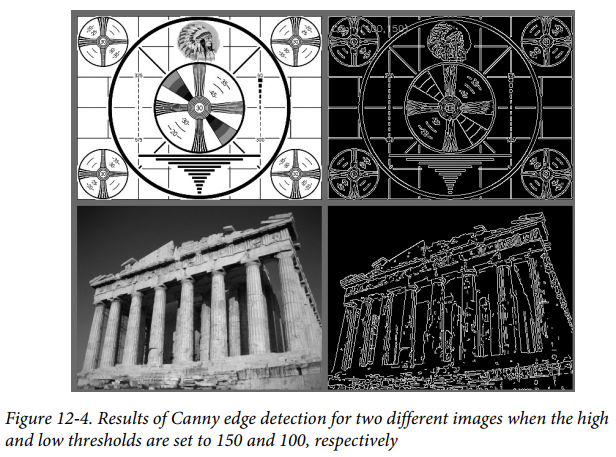
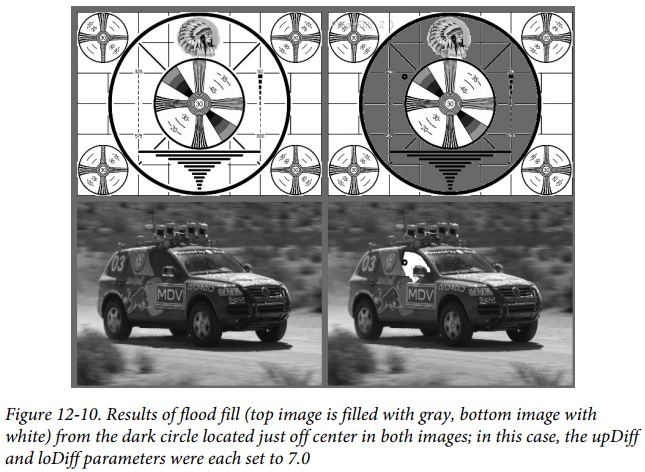
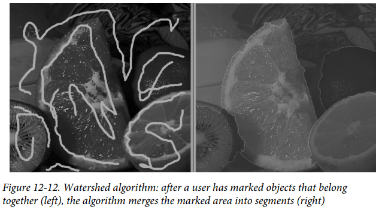
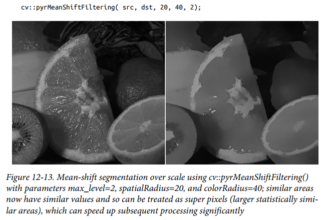

# 第十二章  图像分析

[TOC]

##一：离散傅里叶变换

### 1.1 DFT

离散傅里叶变换：

```c++
void cv::dft(
	cv::InputArray src, // Input array (real or complex)
	cv::OutputArray dst, // Output array
	int flags = 0, // for inverse, or other options
	int nonzeroRows = 0 // number of rows to not ignore
);
```

离散傅里叶反变换：

```c++
void cv::idft(
	cv::InputArray src, // Input array (real or complex)
	cv::OutputArray dst, // Output array
	int flags = 0, // for variations
	int nonzeroRows = 0 // number of rows to not ignore
);
```

频谱倍增：

```c++
void cv::mulSpectrums(
	cv::InputArray src1, // Input array (ccs or complex)
	cv::InputArray src2, // Input array (ccs or complex)
	cv::OutputArray dst, // Result array
	int flags, // for row-by-row computation
	bool conj = false // true to conjugate src2
);
```

使用离散傅里叶变换和反变换加速卷积计算示例：

```c++
#include <opencv2/opencv.hpp>
#include <iostream>
using namespace std;

int main(int argc, char** argv) 
{
	if(argc != 2) {
		cout << "Fourier Transform\nUsage: " <<argv[0] <<" <imagename>" << endl;
		return -1;
	}
	cv::Mat A = cv::imread(argv[1],0);
	if( A.empty() ) { cout << "Cannot load " << argv[1] << endl; return -1; }
	
  	cv::Size patchSize( 100, 100 );
  	cv::Point topleft( A.cols/2, A.rows/2 );
	cv::Rect roi( topleft.x, topleft.y, patchSize.width, patchSize.height );
	cv::Mat B = A( roi );
	int dft_M = cv::getOptimalDFTSize( A.rows+B.rows-1 );
	int dft_N = cv::getOptimalDFTSize( A.cols+B.cols-1 );
  
	cv::Mat dft_A = cv::Mat::zeros( dft_M, dft_N, CV::F32 );
	cv::Mat dft_B = cv::Mat::zeros( dft_M, dft_N, CV::F32 );
	cv::Mat dft_A_part = dft_A( Rect(0, 0, A.cols,A.rows) );
	cv::Mat dft_B_part = dft_B( Rect(0, 0, B.cols,B.rows) );
	A.convertTo( dft_A_part, dft_A_part.type(), 1, -mean(A)[0] );
	B.convertTo( dft_B_part, dft_B_part.type(), 1, -mean(B)[0] );
	cv::dft( dft_A, dft_A, 0, A.rows );
	cv::dft( dft_B, dft_B, 0, B.rows );
	
  	// set the last parameter to false to compute convolution instead of correlation
	//
	cv::mulSpectrums( dft_A, dft_B, dft_A, 0, true );
	cv::idft( dft_A, dft_A, DFT_SCALE, A.rows + B.rows - 1 );
	cv::Mat corr = dft_A( Rect(0, 0, A.cols + B.cols - 1, A.rows + B.rows - 1) );
	cv::normalize( corr, corr, 0, 1, NORM_MINMAX, corr.type() );
	cv::pow( corr, 3., corr );
  
	cv::B ^= cv::Scalar::all( 255 );
	cv::imshow( "Image", A );
	cv::imshow( "Correlation", corr );
	cv::waitKey();
	return 0;
}
```

### 1.2 离散余弦变换

离散余弦变换：

```c++
void cv::dct(
	cv::InputArray src, // Input array (even size)
	cv::OutputArray dst, // Output array
	int flags = 0 // for row-by-row or inverse
);
```

离散余弦反变换：

```c++
void cv::idct(
	cv::InputArray src, // Input array
	cv::OutputArray dst, // Output array
	int flags = 0, // for row-by-row computation
);
```


## 二：积分图像

### 2.1 Standard Summation Integral 

$$
sum(x,y)=\sum_{y^{'}<y}\sum_{x^{'}<x}image(x^{'},y^{'})
$$

```c++
void cv::integral(
	cv::InputArray image, // Input array
	cv::OutputArray sum, // Output sum results
	int sdepth = -1 // Results depth (e.g., cv::F32)
);
```

### 2.2 Squared Summation Integral 

$$
sum_{square}(x,y)=\sum_{y^{'}<y}\sum_{x^{'}<x}[image(x^{'},y^{'})]^{2}
$$

```c++
void cv::integral(
	cv::InputArray image, // Input array
	cv::OutputArray sum, // Output sum results
	cv::OutputArray sqsum, // Output sum of squares results
	int sdepth = -1 // Results depth (e.g., cv::F32)
);
```

###2.3 Tilted Summation Integral  

$$
sum_{tilted}(x,y)=\sum_{y^{'}<y}\sum_{abs(x^{'}-x)<y}image(x^{'},y^{'})
$$

```c++
void cv::integral(
	cv::InputArray image, // Input array
	cv::OutputArray sum, // Output sum results
	cv::OutputArray sqsum, // Output sum of squares results
	cv::OutputArray tilted, // Output tilted sum results
	int sdepth = -1 // Results depth (e.g., cv::F32)
);
```


## 三：Canny边缘检测

```c++
void cv::Canny(
	cv::InputArray image, // Input single channel image
	cv::OutputArray edges, // Output edge image
	double threshold1, // "lower" threshold
	double threshold2, // "upper" threshold
	int apertureSize = 3, // Sobel aperture
	bool L2gradient = false // true=L2-norm (more accurate)
);
```






## 四：Hough变换

### 4.1 Hough线变换

```c++
void cv::HoughLines(
	cv::InputArray image, // Input single channel image
	cv::OutputArray lines, // N-by-1 two-channel array
	double rho, // rho resolution (pixels)
	double theta, // theta resolution (radians)
	int threshold, // Unnormalized accumulator threshold
	double srn = 0, // rho refinement (for MHT)
	double stn = 0 // theta refinement (for MHT)
);

void cv::HoughLinesP(
	cv::InputArray image, // Input single channel image
	cv::OutputArray lines, // N-by-1 4-channel array
	double rho, // rho resolution (pixels)
	double theta, // theta resolution (radians)
	int threshold, // Unnormalized accumulator threshold
	double minLineLength = 0, // required line length
	double maxLineGap = 0 // required line separation
);
```

### 4.2 Hough圆变换

```c++
void cv::HoughCircles(
	cv::InputArray image, // Input single channel image
	cv::OutputArray circles, // N-by-1 3-channel or vector of Vec3f
	int method, // Always cv::HOUGH_GRADIENT
	double dp, // Accumulator resolution (ratio)
	double minDist, // Required separation (between lines)
	double param1 = 100, // Upper Canny threshold
	double param2 = 100, // Unnormalized accumulator threshold
	int minRadius = 0, // Smallest radius to consider
	int maxRadius = 0 // Largest radius to consider
);
```

示例：

```c++
#include <opencv2/opencv.hpp>
#include <iostream>
#include <math.h>
using namespace cv;
using namespace std;

int main(int argc, char** argv) 
{
	if(argc != 2) {
		cout << "Hough Circle detect\nUsage: " <<argv[0] <<" <imagename>\n" << endl;
		return -1;
	}

  	cv::Mat src, image;
	src = cv::imread( argv[1], 1 );
	if( src.empty() ) { cout << "Cannot load " << argv[1] << endl; return -1; }
	cv::cvtColor(src, image, cv::BGR2GRAY);
	cv::GaussianBlur(image, image, Size(5,5), 0, 0);

  	vector<cv::Vec3f> circles;
	cv::HoughCircles(image, circles, cv::HOUGH_GRADIENT, 2, image.cols/10);
	for( size_t i = 0; i < circles.size(); ++i ) {
		cv::circle(src, cv::Point(cvRound(circles[i][0]), cvRound(circles[i][1])),
			cvRound(circles[i][2]), cv::Scalar(0,0,255), 2, cv::AA);
	}
	cv::imshow( "Hough Circles", src);
	cv::waitKey(0);
	return 0;
}
```


## 五：图像分割

### 5.1 洪水填充

```c++
int cv::floodFill(
	cv::InputOutputArray image, // Input image, 1 or 3 channels
	cv::Point seed, // Start point for flood
	cv::Scalar newVal, // Value for painted pixels
	cv::Rect* rect, // Output bounds painted domain
	cv::Scalar lowDiff = cv::Scalar(),// Maximum down color distance
	cv::Scalar highDiff = cv::Scalar(),// Maximum up color distance
	int flags // Local/global, and mask-only
);

int cv::floodFill(
	cv::InputOutputArray image, // Input w-by-h, 1 or 3 channels
	cv::InputOutputArray mask, // 8-bit, w+2-by-h+2 (Nc=1)
	cv::Point seed, // Start point for flood
	cv::Scalar newVal, // Value for painted pixels
	cv::Rect* rect, // Output bounds painted domain
	cv::Scalar lowDiff = cv::Scalar(), // Maximum down color distance
	cv::Scalar highDiff = cv::Scalar(), // Maximum up color distance
	int flags // Local/global, and mask-only
);
```



### 5.2 分水岭算法

```c++
void cv::watershed(
	cv::InputArray image, // Input 8-bit, three channels
	cv::InputOutputArray markers // 32-bit float, single channel
);
```



### 5.3 Grabcuts

```c++
void cv::grabCut(
	cv::InputArray img,
	cv::InputOutputArray mask,
	cv::Rect rect,
	cv::InputOutputArray bgdModel,
	cv::InputOutputArray fgdModel,
	int iterCount,
	int mode = cv::GC_EVAL
);
```

### 5.4 均值漂移分割

```c++
void cv::pyrMeanShiftFiltering(
	cv::InputArray src, // 8-bit, Nc=3 image
	cv::OutputArray dst, // 8-bit, Nc=3, same size as src
	cv::double sp, // Spatial window radius
	cv::double sr, // Color window radius
	int maxLevel = 1, // Max pyramid level
	cv::TermCriteria termcrit = TermCriteria(
		cv::TermCriteria::MAX_ITER | cv::TermCriteria::EPS,
		5,
		1
	)
);
```




