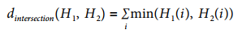

# 第十三章  直方图和模板

[TOC]

## 一：OpenCV直方图表示

直方图计算：

```c++
void cv::calcHist(
	const cv::Mat* images, // C-style array of images, 8U or 32F
	int nimages, // number of images in 'images' array
	const int* channels, // C-style list of int's, lists channels
	cv::InputArray mask, // in 'images' count, iff 'mask' nonzero
	cv::OutputArray hist, // output histogram array
	int dims, // hist dimensionality < cv::MAX_DIMS (32)
	const int* histSize, // C-style array, hist sizes in each dim
	const float** ranges, // C-style array, 'dims' pairs set bin sizes
	bool uniform = true, // true for uniform binning
	bool accumulate = false // true, add to 'hist' else replace
);

void cv::calcHist(
	const cv::Mat* images, // C-style array of images, 8U or 32F
	int nimages, // number of images in 'images' array
	const int* channels, // C-style list of int's, lists channels
	cv::InputArray mask, // in 'images' count, iff 'mask' nonzero
	cv::SparseMat& hist, // output histogram (sparse) array
	int dims, // hist dimensionality < cv::MAX_DIMS (32)
	const int* histSize, // C-style array, hist sizes in each dim
	const float** ranges, // C-style array, 'dims' pairs set bin sizes
	bool uniform = true, // true for uniform binning
	bool accumulate = false // if true, add to 'hist', else replace
);
```


## 二：直方图基本操作

### 2.1 直方图归一化

```c++
cv::Mat normalized = my_hist / sum(my_hist)[0];
or:
cv::normalize( my_hist, my_hist, 1, 0, NORM_L1 );
```

### 2.2 直方图阈值处理

```c++
cv::threshold(
my_hist, // input histogram
my_thresholded_hist, // result, all values<threshold set to zero
threshold, // cutoff value
0, // value does not matter in this case
cv::THRESH_TOZERO // threshold type
);
```

### 2.3 寻找最值

```c++
void cv::minMaxLoc(
	cv::InputArray src, // Input array
	double* minVal, // put minimum value (if not NULL)
	double* maxVal = 0, // put maximum value (if not NULL)
	cv::Point* minLoc = 0, // put minimum location (if not NULL)
	cv::Point* maxLoc = 0, // put maximum location (if not NULL)
	cv::InputArray mask = cv::noArray() // ignore points for which mask is zero
);

void cv::minMaxLoc(
	const cv::SparseMat& src, // Input (sparse) array
	double* minVal, // put min value (if not NULL)
	double* maxVal = 0, // put max value (if not NULL)
	cv::Point* minLoc = 0, // put min location (if not NULL)
	cv::Point* maxLoc = 0, // put max location (if not NULL)
	cv::InputArray mask = cv::noArray() // ignore points if mask is zero
);
```

### 2.4 直方图比较

```c++
double cv::compareHist(
	cv::InputArray H1, // First histogram to be compared
	cv::InputArray H2, // Second histogram to be compared
	int method // comparison method (see options below)
);

double cv::compareHist(
	const cv::SparseMat& H1, // First histogram to be compared
	const cv::SparseMat& H2, // Second histogram to be compared
	int method // comparison method (see options below)
);
```

method:

- cv::COMP_CORREL：

  

- cv::COMP_CHISQR_ALT：

  

- cv::COMP_INTERSECT：

  

- cv::COMP_BHATTACHARYYA：

  

比较：


直方图示例：

```c++
#include <opencv2/opencv.hpp>
#include <iostream>
using namespace std;

int main( int argc, char** argv )
{
	if(argc != 2) {
		cout << "Computer Color Histogram\nUsage: " <<argv[0] <<" <imagename>" << endl;
		return -1;
	}
	cv::Mat src = cv::imread( argv[1],1 );
	if( src.empty() ) { cout << "Cannot load " << argv[1] << endl; return -1; }

  	// Compute the HSV image, and decompose it into separate planes.
	cv::Mat hsv;
	cv::cvtColor(src, hsv, cv::COLOR_BGR2HSV);
	float h_ranges[] = {0, 180}; // hue is [0, 180]
	float s_ranges[] = {0, 256};
	const float* ranges[] = {h_ranges, s_ranges};
	int histSize[] = {30, 32}, ch[] = {0, 1};
	cv::Mat hist;
  
	// Compute the histogram
	cv::calcHist(&hsv, 1, ch, cv::noArray(), hist, 2, histSize, ranges, true);
	cv::normalize(hist, hist, 0, 255, cv::NORM_MINMAX);
	int scale = 10;
	cv::Mat hist_img(histSize[0]*scale, histSize[1]*scale, CV_8UC3);
	
  	// Draw our histogram.
	for( int h = 0; h < histSize[0]; h++ ) {
		for( int s = 0; s < histSize[1]; s++ ){
			float hval = hist.at<float>(h, s);
			cv::rectangle(hist_img, cv::Rect(h*scale,s*scale,scale,scale),
				cv::Scalar::all(hval), -1);
		}
	}
	cv::imshow("image", src);
	cv::imshow("H-S histogram", hist_img);
	cv::waitKey();
	return 0;
}
```


## 三：其他操作

### 3.1 EMD距离(Earth Mover’s Distance)

EMD和欧氏距离一样是距离的一种度量，OpenCV中可以通过EMD函数计算：

```c++
float cv::EMD(
	cv::InputArray signature1, // sz1-by-(dims+1) float array
	cv::InputArray signature2, // sz2-by-(dims+1) float array
	int distType, // distance type (e.g., 'cv::DIST_L1')
	cv::InputArray cost = noArray(), // sz1-by-sz2 array (if cv::DIST_USER)
	float* lowerBound = 0, // input/output low bound on distance
	cv::OutputArray flow = noArray() // output, sz1-by-sz2
);
```

示例：

```c++
#include <opencv2/opencv.hpp>
#include <iostream>
using namespace std;

void help( char** argv ){
	cout << "\nCall is:\n"
		<< argv[0] <<" modelImage0 testImage1 testImage2 badImage3\n\n"
		<< "for example: "
		<< " ./ch7_ex7_3_expanded HandIndoorColor.jpg HandOutdoorColor.jpg "
		<< "HandOutdoorSunColor.jpg fruits.jpg\n"
		<< "\n";
	}

// Compare 3 images' histograms
int main( int argc, char** argv ) 
{
	if( argc != 5 ) { help( argv ); return -1; }
	
  	vector<cv::Mat> src(5);
	cv::Mat tmp;
	int i;
	tmp = cv::imread( argv[1], 1);
	if( tmp.empty() ) {
		cerr << "Error on reading image 1," << argv[1] << "\n" << endl;
		help();
		return(-1);
	}
  
	// Parse the first image into two image halves divided halfway on y
	cv::Size size = tmp.size();
	int width = size.width;
	int height = size.height;
	int halfheight = height >> 1;
	cout <<"Getting size [[" <<tmp.cols <<"] [" <<tmp.rows <<"]]\n" <<endl;
	cout <<"Got size (w,h): (" <<size.width <<"," <<size.height <<")" <<endl;
	src[0] = cv::Mat(cv::Size(width,halfheight), CV_8UC3);
	src[1] = cv::Mat(cv::Size(width,halfheight), CV_8UC3);

  	// Divide the first image into top and bottom halves into src[0] and src[1]
	cv::Mat_<cv::Vec3b>::iterator tmpit = tmp.begin<cv::Vec3b>();
	// top half
	cv::Mat_<cv::Vec3b>::iterator s0it = src[0].begin<cv::Vec3b>();
	for(i = 0; i < width*halfheight; ++i, ++tmpit, ++s0it) *s0it = *tmpit;
	// Bottom half
	cv::Mat_<cv::Vec3b>::iterator s1it = src[1].begin<cv::Vec3b>();
	for(i = 0; i < width*halfheight; ++i, ++tmpit, ++s1it) *s1it = *tmpit;

  	// Load the other three images
	for(i = 2; i<5; ++i){
		src[i] = cv::imread(argv[i], 1);
		if(src[i].empty()) {
			cerr << "Error on reading image " << i << ": " << argv[i] << "\n" << endl;
			help();
			return(-1);
		}
	}
  
	// Compute the HSV image, and decompose it into separate planes.
	vector<cv::Mat> hsv(5), hist(5), hist_img(5);
	int h_bins = 8;
	int s_bins = 8;
	int hist_size[] = { h_bins, s_bins }, ch[] = {0, 1};
	float h_ranges[] = { 0, 180 }; // hue range is [0,180]
	float s_ranges[] = { 0, 255 };
	const float* ranges[] = { h_ranges, s_ranges };
	int scale = 10;
	for(i = 0; i<5; ++i) {
		cv::cvtColor( src[i], hsv[i], cv::BGR2HSV );
		cv::calcHist( &hsv[i], 1, ch, noArray(), hist[i], 2, hist_size, ranges, true );
		cv::normalize( hist[i], hist[i], 0, 255, cv::NORM_MINMAX );
		hist_img[i] = cv::Mat::zeros( hist_size[0]*scale, hist_size[1]*scale, CV_8UC3 );
		// Draw our histogram For the 5 images
		for( int h = 0; h < hist_size[0]; h++ )
			for( int s = 0; s < hist_size[1]; s++ ){
				float hval = hist[i].at<float>(h, s);
				cv::rectangle(hist_img[i], v::Rect(h*scale, s*scale, scale, scale),
					cv::Scalar::all(hval), 1);
			}
	}
  
	// Display
	cv::namedWindow( "Source0", 1 );cv::imshow( "Source0", src[0] );
	cv::namedWindow( "HS Histogram0", 1 );cv::imshow( "HS Histogram0", hist_img[0] );
	cv::namedWindow( "Source1", 1 );cv::imshow( "Source1", src[1] );
	cv::namedWindow( "HS Histogram1", 1 ); cv::imshow( "HS Histogram1", hist_img[1] );
	cv::namedWindow( "Source2", 1 ); cv::imshow( "Source2", src[2] );
	cv::namedWindow( "HS Histogram2", 1 ); cv::imshow( "HS Histogram2", hist_img[2] );
	cv::namedWindow( "Source3", 1 ); cv::imshow( "Source3", src[3] );
	cv::namedWindow( "HS Histogram3", 1 ); cv::imshow( "HS Histogram3", hist_img[3] );
	cv::namedWindow( "Source4", 1 ); cv::imshow( "Source4", src[4] );
	cv::namedWindow( "HS Histogram4", 1 ); cv::imshow( "HS Histogram4", hist_img[4] );
	// Compare the histogram src0 vs 1, vs 2, vs 3, vs 4
	cout << "Comparison:\n"
		<< "Corr Chi Intersect Bhat\n" < endl;
	for(i=1; i<5; ++i) { // For each histogram
		cout << "Hist[0] vs Hist[" << i << "]: " << endl;;
		for(int j=0; j<4; ++j) { // For each comparison type
			cout << "method[" << j << "]: " << cv::compareHist(hist[0],hist[i],j) << " ";
		}
		cout << endl;
	}
  
	//Do EMD and report
	vector<cv::Mat> sig(5);
	cout << "\nEMD: " << endl;
	// Oi Vey, parse histograms to earth movers signatures
	for( i=0; i<5; ++i) {
		vector<cv::Vec3f> sigv;
		// (re)normalize histogram to make the bin weights sum to 1.
	cv::normalize(hist[i], hist[i], 1, 0, cv::NORM_L1);
	for( int h = 0; h < h_bins; h++ )
		for( int s = 0; s < s_bins; s++ ) {
			float bin_val = hist[i].at<float>(h, s);
			if( bin_val != 0 )
			sigv.push_back( cv::Vec3f(bin_val, (float)h, (float)s));
		}
		// make Nx3 32fC1 matrix, where N is the number of nonzero histogram bins
		sig[i] = cv::Mat(sigv).clone().reshape(1);
		if( i > 0 )
			cout << "Hist[0] vs Hist[" << i << "]: "
				<< EMD(sig[0], sig[i], cv::DIST_L2) << endl;
	}
	cv::waitKey(0);
}
```

### 3.2 反向投影

```c++
void cv::calcBackProject(
	const cv::Mat* images, // C-style array of images, 8U or 32F
	int nimages, // number of images in 'images' array
	const int* channels, // C-style list, ints identifying channels
	cv::InputArray hist, // input histogram array
	cv::OutputArray backProject, // output single channel array
	const float** ranges, // C-style array, 'dims' pairs of bin sizes
	double scale = 1, // Optional scale factor for output
	bool uniform = true // true for uniform binning
);
void cv::calcBackProject(
	const cv::Mat* images, // C-style array of images, 8U or 32F
	int nimages, // number of images in 'images' array
	const int* channels, // C-style list, ints identifying channels
	const cv::SparseMat& hist, // input (sparse) histogram array
	cv::OutputArray backProject, // output single channel array
	const float** ranges, // C-style array, 'dims' pairs of bin sizes
	double scale = 1, // Optional scale factor for output
	bool uniform = true // true for uniform binning
);
void cv::calcBackProject(
	cv::InputArrayOfArrays images, // STL-vector of images, 8U or 32F
	const vector<int>& channels, // STL-vector, channels indices
	cv::InputArray hist, // input histogram array
	cv::OutputArray backProject, // output single channel array
	const vector<float>& ranges, // STL-style vector, range boundaries
	double scale = 1, // Optional scale factor for output
	bool uniform = true // true for uniform binning
);
```


## 四：模板匹配

```c++
void cv::matchTemplate(
	cv::InputArray image, // Input image to be searched, 8U or 32F, size W-by-H
	cv::InputArray templ, // Template to use, same type as 'image', size w-by-h
	cv::OutputArray result, // Result image, type 32F, size (W-w+1)-by(H-h+1)
	int method // Comparison method to use
);
```

method:

- Square Difference Matching Method (cv::TM_SQDIFF) 
- Normalized Square Difference Matching Method(cv::TM_SQDIFF_NORMED) 
- Correlation Matching Methods (cv::TM_CCORR) 
- Normalized Cross-Correlation Matching Method(cv::TM_CCORR_NORMED) 
- Correlation Coefficient Matching Methods (cv::TM_CCOEFF) 
- Normalized Correlation Coefficient Matching Method(cv::TM_CCOEFF_NORMED) 

示例：

```c++
#include <opencv2/opencv.hpp>
#include <iostream>
using namespace std;

void help( argv ){
	cout << "\n"
		<<"Example of using matchTemplate(). The call is:\n" 
      	<<"\n"
		<<argv[0] <<" template image_to_be_searched\n"
		<<"\n"
		<<" This routine will search using all methods:\n"
		<<" cv::TM_SQDIFF 0\n"
		<<" cv::TM_SQDIFF_NORMED 1\n"
		<<" cv::TM_CCORR 2\n"
		<<" cv::TM_CCORR_NORMED 3\n"
		<<" cv::TM_CCOEFF 4\n"
		<<" cv::TM_CCOEFF_NORMED 5\n"
		<<"\n";
	}

// Display the results of the matches
int main( int argc, char** argv ) 
{
	if( argc != 3) {
		help( argv );
		return -1;
	}
  
	cv::Mat src, templ, ftmp[6]; // ftmp is what to display on
	// Read in the template to be used for matching:
	if((templ=cv::imread(argv[1], 1)).empty()) {
		cout << "Error on reading template " << argv[1] << endl;
		help( argv );return -1;
	}
	// Read in the source image to be searched:
	if((src=cv::imread(argv[2], 1)).empty()) {
		cout << "Error on reading src image " << argv[2] << endl;
		help( argv );return -1;
	}
  
	// Do the matching of the template with the image
	for(int i=0; i<6; ++i){
		cv::matchTemplate( src, templ, ftmp[i], i);
		cv::normalize(ftmp[i],ftmp[i],1,0,cv::MINMAX);
	}
	
  	// Display
	cv::imshow( "Template", templ );
	cv::imshow( "Image", src );
  	cv::imshow( "SQDIFF", ftmp[0] );
	cv::imshow( "SQDIFF_NORMED", ftmp[1] );
	cv::imshow( "CCORR", ftmp[2] );
	cv::imshow( "CCORR_NORMED", ftmp[3] );
	cv::imshow( "CCOEFF", ftmp[4] );
	cv::imshow( "CCOEFF_NORMED", ftmp[5] );
	cv::waitKey(0);
}
```

