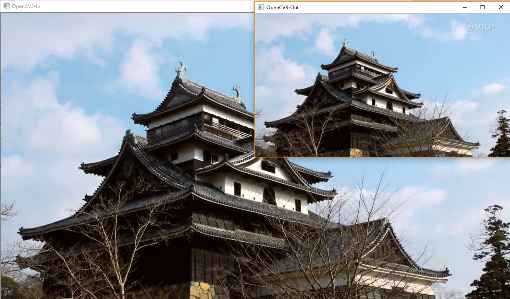
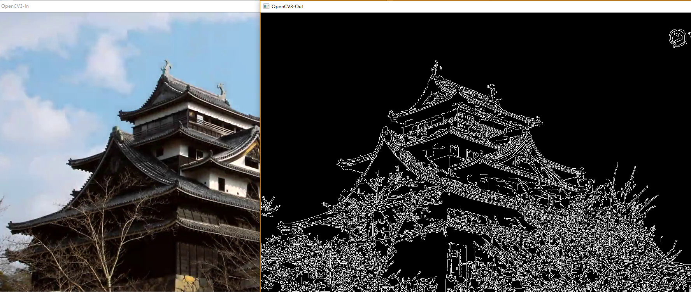

# OpenCV3介绍

[TOC]

本章主要介绍OpenCV3的输入和输出以及一些简单的概念。OpenCV3怎样读取显示一幅图片？读取显示视频？如何对它们做些简单的处理？处理完又如何保存？对这个流程的认识有助于我们更清楚OpenCV项目的处理结构。

此外，OpenCV3是按照模块组织的，本章介绍的输入和输出集成在 **HighGUI** 模块中。可以参考官方文档了解各个模块的划分和作用。


## 一：如何读取和显示一幅静态图片

下面的程序读取和显示了一幅名称为“test.jpg”的图片：

````c++
#include <iostream>
#include "opencv2\opencv.hpp"
using namespace cv;

int main()
{
	Mat img = imread("./test.jpg");
	if (img.empty())
		return -1;

	namedWindow("OpenCV3", WINDOW_AUTOSIZE);
	imshow("OpenCV3",img);
	waitKey(0);

	destroyWindow("OpenCV3");
	return 0;
}
````

**头文件和命名空间：** 

头文件包含形式可以分别包含需要的各模块的头文件，比如 **“highgui.hpp”** 等，也可以包含总的头文件 **“opencv.hpp”** 。包含总的头文件时编译时间会延长，但比较省心。

OpenCV3的所有函数都在命名空间 **cv** 里，因此使用 **“using namespace cv;”** 就可以免去在引用的OpenCV函数前再加 **"cv::"** 的麻烦。  

**图像读取：** 

**imread** 函数实现图像的读取，这和Matlab一致；读取后可以通过 **“empty()”** 来判断是否读取成功。

**Mat** 类负责图像数据的存储，它可以自动分配内存和自动释放，可理解为**“智能指针”** ，这个类在OpenCV中相当重要，后续会详细介绍。

**图像显示：**

图像显示需要一个窗口，有Win32 APi开发经验的都知道Windows下显示一个窗口相当麻烦，而OpenCV使用 **namedWindow** 命名窗口方式可以简化窗口的平台创建流程。当然，创建时也可以为窗口指定一些属性，例如是否固定大小等，之后就可以把读取的图像显示在窗口了。

**"imshow()"** 之后一定要使用 **"waitKey() "**  ，它等待固定毫秒数，如果指定为0则会无限等待下去，直到有按键被触发。如果 **“imshow()”** 之后不使用 **“waitKey()”** 则很可能显示不出图像。


## 二：如何读取和显示视频

### 2.1 文件视频的读取和显示

####2.1.1 从文件中读取和显示视频

如果有份命名为“test.mp4”的MP4文件，则可以通过以下方式使用OpenCV3读取和显示：

````c++
#include <iostream>
#include "opencv2\opencv.hpp"
using namespace cv;

int main()
{
	VideoCapture cap;
	cap.open("./test.mp4");
	if (!cap.isOpened())
		return -1;

	namedWindow("OpenCV3", WINDOW_AUTOSIZE);
	Mat frame;
	for (;;) 
	{
		cap >> frame;
		if (frame.empty()) 
			break;

		imshow("OpenCV3", frame);
		if (waitKey(33) >= 0) 
			break;
	}

	destroyWindow("OpenCV3");
	return 0;
}
````

**视频的读取：**

**VideoCapture** 类负责视频的读取，使用重载的输出运算符 **“>>”** 可以很方便从文件中读取一帧图像。在**VideoCapture** 初始化的时候，会预先读入需要的视频信息，例如视频大小、格式、分辨率等。**由于OpenCV3对视频的处理使用ffmepg开源项目，因此只要是ffmpeg支持的视频格式类型VideoCapture类就可以正常操作** 。

视频读取流程为： 文件  ->  文件信息读取 ->  【 逐帧读取 -> ffmpeg 解码  ->  显示 】（此处循环）

**视频显示：**

使用for循环读取和显示视频，当视频读取完毕或者用户有键盘输入时，读取循环结束。在每帧读取显示完毕后延迟 33ms ，这主要是用于视频的**帧控制** ，如果不做帧控制则视频文件会很快被读取完，显示的视频也是相当快速的。

#### 2.1.2 使用控制条控制播放

一般视频播放器都有快进和快退功能，使用OpenCV3提供的控制条工具也可以实现视频播放的简单控制。控制条工具是OpenCV3提供的为数不多的GUI控件。

下面为实现视频索引的简单程序：

```c++
#include <iostream>
#include "opencv2\opencv.hpp"
using namespace cv;

int g_sliderPosition = 0;
bool g_bPause = false;
VideoCapture g_cap;
void onTrackbarSlide(int pos, void *)
{
	g_bPause = true;
	g_cap.set(CAP_PROP_POS_FRAMES, pos);
	g_bPause = false;
}

int main()
{
	g_cap.open("./test.mp4");
	if (!g_cap.isOpened())
		return -1;
	int nFrames = (int)g_cap.get(CAP_PROP_FRAME_COUNT);
	int nWidth = (int)g_cap.get(CAP_PROP_FRAME_WIDTH);
	int nHeight = (int)g_cap.get(CAP_PROP_FRAME_HEIGHT);
	
	namedWindow("OpenCV3", WINDOW_AUTOSIZE);
	createTrackbar("Position", "OpenCV3", &g_sliderPosition, nFrames, onTrackbarSlide);
	Mat frame;
	for (;;) 
	{
		if (!g_bPause) 
		{
			g_cap >> frame; 
			if (frame.empty()) 
				break;
			
			int nCurPos = (int)g_cap.get(CAP_PROP_POS_FRAMES);
			setTrackbarPos("Position", "OpenCV3", nCurPos);
			imshow("OpenCV3", frame);
		}

		if (waitKey(10) >= 0)
			break;
	}

	return 0;
}
```

**VideoCapture** 的 **get()/set()** 方式可以获得和设置视频信息，控制条的量程被设置成视频总帧数，在控制条回调函数中设置到相应的位置。

#### 2.1.3 对视频帧的简单处理

OpenCV专注于图像处理和计算机视觉，上面已经可以读取和显示视频了，本节将在视频显示之前对每帧进行简单的高斯滤波。

```c++
#include <iostream>
#include "opencv2\opencv.hpp"
using namespace cv;

int main()
{
  	VideoCapture cap;
	cap.open("./test.mp4");
	if (!cap.isOpened())
		return -1;

	namedWindow("OpenCV3-In", WINDOW_AUTOSIZE);
	namedWindow("OpenCV3-Out", WINDOW_AUTOSIZE);
	Mat frame;
	for (;;)
	{
		cap >> frame;
		if (frame.empty())
			break;

		Mat out;
		// 高斯滤波
      	GaussianBlur(frame, out, Size(5, 5), 3, 3);
		//GaussianBlur(out, out, Size(5, 5), 3, 3);
      	// 图像金字塔下采样
		//pyrDown(frame, out);
      	// Canny边缘检测
      	//Mat gray;
		//cvtColor(frame, gray, cv::COLOR_BGR2GRAY);
		//cv::Canny(gray, out, 10, 100, 3, true);
      	imshow("OpenCV3-In", frame);
		imshow("OpenCV3-Out", out);
		if (waitKey(33) >= 0)
			break;
	}

	destroyWindow("OpenCV3");
	return 0;
}
```

**Size(5,5)** 用于产生高斯滤波的模板，一般模板尺寸为奇数，数字图像处理课程说的很清楚。Out为滤波后的图像，很显然Out的图像比In图像模糊：


同样，我们也可以使用 **pyrDown(frame, out);** 图像金字塔向下采样处理，将视频大小（长、宽）变为原来的一半：

或使用 **Canny** 边缘检测：



以上就简单了解了OpenCV的处理流程。

###2.2 相机的采集和显示

OpenCV3处理相机的采集和处理视频文件的流程极为相似，同样也使用 **VideoCapture** 类，唯一不同的是视频文件由文件名指定，而相机则由 **相机ID** 索引指定。-1为默认的相机ID，即“随机选取一个相机”；相机ID从0开始，依次递增。

以下为使用默认相机（ID=-1）采集的示例：

```c++
#include <iostream>
#include "opencv2\opencv.hpp"
using namespace cv;

int main()
{
  	VideoCapture cap;
	cap.open(-1);
	if (!cap.isOpened())
		return -1;

	namedWindow("OpenCV3", WINDOW_AUTOSIZE);
	Mat frame;
	for (;;)
	{
		cap >> frame;
		if (frame.empty())
			break;

		imshow("OpenCV3", frame);
		if (waitKey(5) >= 0)
			break;
	}

	destroyWindow("OpenCV3");
	return 0;
}
```

**相机采集：**

上述程序与从文件中读取和显示视频仅open时的参数不同，其他一样。

之前从视频文件读取视频需要做帧控制，要不然显示就会过快；而使用相机采集时一般无需帧控，因为当相机的一帧采集完毕且被读取后，如果VideoCapture又要读取，则会因为相机的下一帧还没准备完毕而导致读取操作阻塞，直到相机准备好了下一帧VideoCapture才会读取成功。

> 阻塞操作可能和相机硬件和驱动有关。另外，常见的USB摄像头在MJPG格式时候可以输出的帧率最大，采集之前需要使用 "set()" 设置相机采集的图像格式属性。


## 三：如何写入AVI文件

当需要保存视频时，使用 **VideoWriter** 类可以很方便地将视频写入特定格式地文件。下面示例对读取的视频做 **对数极坐标** 变换，之后将变换结果保存到AVI文件中：

```c++
#include <iostream>
#include "opencv2\opencv.hpp"
using namespace cv;

int main()
{
  	VideoCapture cap("./test.mp4");
	if (!cap.isOpened())
		return -1;
	double fps = cap.get(CAP_PROP_FPS);
	Size size((int)cap.get(CAP_PROP_FRAME_WIDTH),(int)cap.get(CAP_PROP_FRAME_HEIGHT));
	VideoWriter writer;
	writer.open("./logPolor.avi", CV_FOURCC('M', 'J', 'P', 'G'), fps, size);
	
	namedWindow("OpenCV3_In", WINDOW_AUTOSIZE);
	namedWindow("OpenCV3_Out", WINDOW_AUTOSIZE);
	cv::Mat logpolarFrame, bgrFrame;
	for (;;) 
	{
		cap >> bgrFrame;
		if (bgrFrame.empty()) 
			break;

		logPolar(bgrFrame,logpolarFrame,Point2f(bgrFrame.cols / 2,bgrFrame.rows / 2),40,WARP_FILL_OUTLIERS);
		imshow("OpenCV3_In", bgrFrame);
		imshow("OpenCV3_Out", logpolarFrame);
		
		writer << logpolarFrame;
		if (waitKey(33) >= 0)
			break;
	}

	cap.release();
	return 0;
}
```

**CV_FOURCC** 用于生成特定的标识数来唯一确定相应的格式，**CV_FOURCC(’M’,’J’,’P’,’G’)** 表示MJPG格式。 很多开源库中的色彩格式也用此种方式指定，这些数又叫”魔数“，即生成的唯一标识数。

