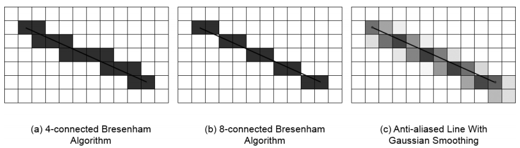

# 绘图和注释

[TOC]

OpenCV3提供在图像上绘图的功能。通常情况下，绘图操作涉及单通道（灰度图像）和三通道（彩色图像）操作，Alpha通道的绘制暂时不支持。此外，OpenCV3组织彩色图像的方式为BGR排列，而不是常见的RGB排列顺序。

## 一：线和填充多边形

线绘制的时候往往会涉及两个参数： **thickness和lineType** 。一般lineType取值有三种：4，8或者cv::LINE_AA；thickness为线的宽度，对于圆形、矩形或者一些其他的封闭多边形，thickness可以设置为cv::FILLED，此时将对多边形使用边界颜色进行填充。

一般来说，绘图的起始点、结束点、角点等参数都为整数类型，但OpenCV3绘制函数支持的 **shitf** 参数可以进行亚像素点即非整数点的绘制。一般在绘制函数中传入shift值作为小数位数使用。

绘图功能：

| 函数                   | 描述                                       |
| -------------------- | ---------------------------------------- |
| cv::circle()         | Draw a simple circle                     |
| cv::clipLine()       | Determine if a line is inside a given box |
| cv::ellipse()        | Draw an ellipse, which may be tilted or an elliptical arc |
| cv::ellipse2Poly()   | Compute a polygon approximation to an elliptical arc |
| cv::fillConvexPoly() | Draw filled versions of simple polygons  |
| cv::fillPoly()       | Draw filled versions of arbitrary polygons |
| cv::line()           | Draw a simple line                       |

## 二：字体和文本

文本绘制功能：

| 函数                | 描述                                       |
| ----------------- | ---------------------------------------- |
| cv::putText()     | Draw the specified text in an image      |
| cv::getTextSize() | Determine the width and height of a text string |

