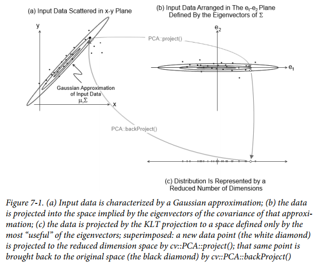

# 仿函数

[TOC]

仿函数(functor)，就是使一个类的使用看上去像一个函数。其实现就是类中实现一个operator()，这个类就有了类似函数的行为，就是一个仿函数类了。简言之，就是c++中"()"操作符的重载。

在OpenCV3的使用中可以看到很多功能的实现都涉及仿函数，因此介绍下仿函数的概念很有必要。本章将举几个典型仿函数的例子。


## 一：主成分分析（cv::PCA）

主成分分析（Principal Component Analysis，PCA）是一种对多维度分布进行分析并从分布中提取包含最多信息的子维度的统计方法。PCA分析的维度不必是事先就指定分布的基础维度，事实上，PCA最重要的一个方面就是可以生成按重要度排序的基础空间。空间内的基础向量将成为整体分布协方差矩阵的特征向量，相应的特征值表示在该维度的分布程度。



给定一个分布，PCA对象就可以计算并记录下它的基准，这个基准特征值的特征向量带有该分布的大量信息。因此，可以对拥有该分布的维度进行简化，这种变换叫做KLT。

###1.1 cv::PCA::PCA()

```c++
PCA::PCA();
PCA::PCA(
	cv::InputArray data, // Data, as rows or cols in 2d array
	cv::InputArray mean, // average, if known, 1-by-n or n-by-1
	int flags, // Are vectors rows or cols of 'data'
	int maxComponents = 0 // Max dimensions to retain
);
```

第一个构造函数为默认构造函数；第二个构造函数调用默认构造函数之后立马将参数传递给 PCA::operator()()  。

### 1.2 cv::PCA::operator()() 

```c++
PCA::operator()(
	cv::InputArray data, // Data, as rows or cols in 2d array
	cv::InputArray mean, // average, if known, 1-by-n or n-by-1
	int flags, // Are vectors rows or cols of 'data'
	int maxComponents = 0 // Max dimensions to retain
);
```

此功能即为仿函数操作。具体的实现和完成的功能可参考相关文档。

### 1.3 cv::PCA::project() 

```c++
cv::Mat PCA::project( // Return results, as a 2d matrix
	cv::InputArray vec // points to project, rows or cols, 2d
) const;
void PCA::project(
	cv::InputArray vec // points to project, rows or cols, 2d
	cv::OutputArray result // Result of projection, reduced space
) const;
```

### 1.4 cv::PCA::backProject() 

```c++
cv::Mat PCA::backProject( // Return results, as a 2d matrix
	cv::InputArray vec // Result of projection, reduced space
} const;
void PCA::backProject(
	cv::InputArray vec // Result of projection, reduced space
	cv::OutputArray result // "reconstructed" vectors, full dimension
) const;
```


## 二：奇异值分解（cv::SVD）

具体实现和完成功能参考相关文档。

### 2.1 cv::SVD() 

```c++
SVD::SVD();
SVD::SVD(
	cv::InputArray A, // Linear system, array to be decomposed
	int flags = 0 // what to construct, can A can scratch
);
```

### 2.2 cv::SVD::operator()() 

```c++
SVD::& SVD::operator() (
	cv::InputArray A, // Linear system, array to be decomposed
	int flags = 0 // what to construct, can A be scratch
);
```

### 2.3 cv::SVD::compute() 

```c++
void SVD::compute(
	cv::InputArray A, // Linear system, array to be decomposed
	cv::OutputArray W, // Output array 'W', singular values
	cv::OutputArray U, // Output array 'U', left singular vectors
	cv::OutputArray Vt, // Output array 'Vt', right singular vectors
	int flags = 0 // what to construct, and if A can be scratch
);
```

### 2.4 cv::SVD::solveZ() 

```c++
void SVD::solveZ(
	cv::InputArray A, // Linear system, array to be decomposed
	cv::OutputArray z // One possible solution (unit length)
);
```

### 2.5 cv::SVD::backSubst() 

```c++
void SVD::backSubst(
	cv::InputArray b, // Righthand side of linear system
	cv::OutputArray x // Found solution to linear system
);
void SVD::backSubst(
	cv::InputArray W, // Output array 'W', singular values
	cv::InputArray U, // Output array 'U', left singular vectors
	cv::InputArray Vt, // Output array 'Vt', right singular vectors
	cv::InputArray b, // Righthand side of linear system
	cv::OutputArray x // Found solution to linear system
);
```


## 三：随机数生成器（cv::RNG）

具体实现和完成功能参考相关文档。

### 3.1 cv::RNG() 

```c++
cv::RNG& theRNG( void ); // Return a random number generator

cv::RNG::RNG( void );
cv::RNG::RNG( uint64 state ); // create using the seed 'state'
```

### 3.2 cv::RNG::operator T() 

```c++
cv::RNG::operator uchar();
cv::RNG::operator schar();
cv::RNG::operator ushort();
cv::RNG::operator short int();
cv::RNG::operator int();
cv::RNG::operator unsigned();
cv::RNG::operator float();
cv::RNG::operator double();

unsigned int cv::RNG::operator()(); // Return random value from 0-UINT_MAX
unsigned int cv::RNG::operator()( unsigned int N ); // Return value from 0-(N-1)
```

### 3.3 cv::RNG::uniform() 

```c++
int cv::RNG::uniform( int a, int b ); // Return value from a-(b-1)
float cv::RNG::uniform( float a, float b ); // Return value in range [a,b)
double cv::RNG::uniform( double a, double b ); // Return value in range [a,b)
```

### 3.4 cv::RNG::gaussian() 

```c++
double cv::RNG::gaussian( double sigma ); // Gaussian number, zero mean,std-dev='sigma'
```

### 3.5 cv::RNG::fill() 

```c++
void cv::RNG::fill(
	InputOutputArray mat, // Input array, values will be overwritten
	int distType, // Type of distribution (Gaussian or uniform)
	InputArray a, // min (uniform) or mean (Gaussian)
	InputArray b // max (uniform) or std-deviation (Gaussian)
);
```


