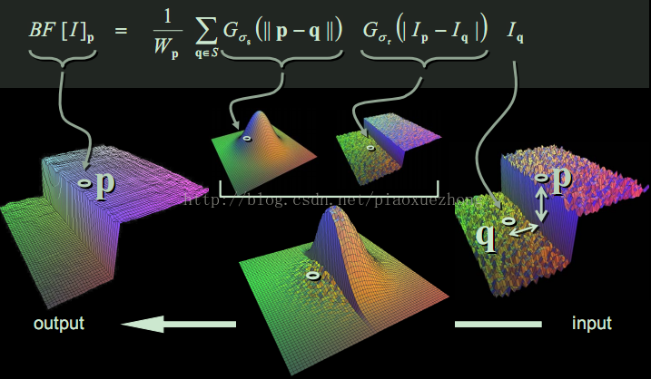

# Image Filter

[TOC]


##一：图像卷积

图像卷积即特定像素点邻域的加权求和过程。

- 核：用于加权的领域模板；一般选择基数行列；
- 锚点：核的中心像素点，也是最后赋值的点；
- 邻域：核的邻域像素点。


## 二：边界填充

一般图像滤波会从图像第一个像素点开始处理，但边缘像素点的邻域并不完整，所以需要对邻域进行填充以便于滤波操作正常进行。下面是OpenCV的边界处理方式：

| Enumerator         | Expression                               |
| ------------------ | ---------------------------------------- |
| BORDER_CONSTANT    | `iiiiii|abcdefgh|iiiiiii` with some specified `i` |
| BORDER_REPLICATE   | `aaaaaa|abcdefgh|hhhhhhh`                |
| BORDER_REFLECT     | `fedcba|abcdefgh|hgfedcb`                |
| BORDER_WRAP        | `cdefgh|abcdefgh|abcdefg`                |
| BORDER_REFLECT_101 | `gfedcb|abcdefgh|gfedcba`                |
| BORDER_TRANSPARENT | `uvwxyz|abcdefgh|ijklmno`                |
| BORDER_REFLECT101  | same as BORDER_REFLECT_101               |
| BORDER_DEFAULT     | same as BORDER_REFLECT_101               |
| BORDER_ISOLATED    | do not look outside of ROI               |

OpenCV滤波操作建议的输入输出：

| Input depth ([src.depth()](https://docs.opencv.org/3.4.3/d0/daf/group__projection.html#ga8b5e5413af41caf3f2a0bbf4cdf517a8)) | Output depth (ddepth)   |
| ---------------------------------------- | ----------------------- |
| CV_8U                                    | -1/CV_16S/CV_32F/CV_64F |
| CV_16U/CV_16S                            | -1/CV_32F/CV_64F        |
| CV_32F                                   | -1/CV_32F/CV_64F        |
| CV_64F                                   | -1/CV_64F               |


## 三：双边滤波

###3.1 理论

双边滤波以 `像素值` 和 `距离` 为度量。在非边缘邻域，以像素值加权为主(采用高斯滤波方法)；在边缘处，以距离为主(欧式距离)；通过对像素值和距离的加权处理得到滤波后的图像，因而既达到滤波效果也不会模糊边缘。 



### 3.2 OpenCV实现

```c++
void cv::bilateralFilter(
	InputArray src,		 // 输入图像
	OutputArray dst,	 // 输出图像
	int d,				// 邻域直径(<0时由sigmaSpace确定)
	double sigmaColor,	 // 像素的sigma值
	double sigmaSpace,	 // 空间的sigma值
	int borderType = BORDER_DEFAULT // 边界填充方式
)	
```

双边滤波器可以很好的保存图像边缘细节而滤除掉低频分量的噪音，但是双边滤波器的效率不是太高，花费的时间相较于其他滤波器而言也比较长。 对于简单的滤波而言，可以将两个sigma值设置成相同的值，如果值 < 10，则对滤波器影响很小，如果值 >150则会对滤波器产生较大的影响，会使图片看起来像卡通。

###3.3 参考

[Bilateral_Filtering](http://homepages.inf.ed.ac.uk/rbf/CVonline/LOCAL_COPIES/MANDUCHI1/Bilateral_Filtering.html)

[Bilateral Filters（双边滤波算法）原理及实现](https://blog.csdn.net/piaoxuezhong/article/details/78302920)

[双边滤波(Bilateral Filter)详解](http://www.360doc.com/content/17/0306/14/28838452_634420847.shtml)

[双边滤波+ 通俗自己理解](https://blog.csdn.net/chenlufei_i/article/details/78897926)


## 四：均值滤波

### 4.1 理论

均值滤波相当简单，即对邻域像素求平均值。
$$
K=\frac{1}{ksize.width*ksize.height}
\begin{bmatrix} 
1 & 1 & 1 & \cdots & 1 & 1 \\
1 & 1 & 1 & \cdots & 1 & 1 \\
\cdots \\
1 & 1 & 1 & \cdots & 1 & 1 \\ 
\end{bmatrix}
$$

### 4.2 OpenCV实现

```c++
void cv::blur(
	InputArray src,		// 输入图像
	OutputArray dst,	// 输出图像
	Size ksize,		    // 核大小ksize * ksize（奇数）
	Point anchor = Point(-1,-1),	// 锚点位置（默认为中心像素点）
	int borderType = BORDER_DEFAULT // 边界类型
)	
```

`blur(src, dst, ksize, anchor, borderType)` 与 `boxFilter(src, dst, src.type(), anchor, true, borderType)` 效果相同。

###4.3 参考

[均值滤波器及其变种](https://www.cnblogs.com/wangguchangqing/p/6399293.html)


## 五：盒状滤波

### 5.1 原理

盒装滤波与均值滤波类似，但只做加权不做平均。


### 5.2 OpenCV实现

### 5.3 参考

